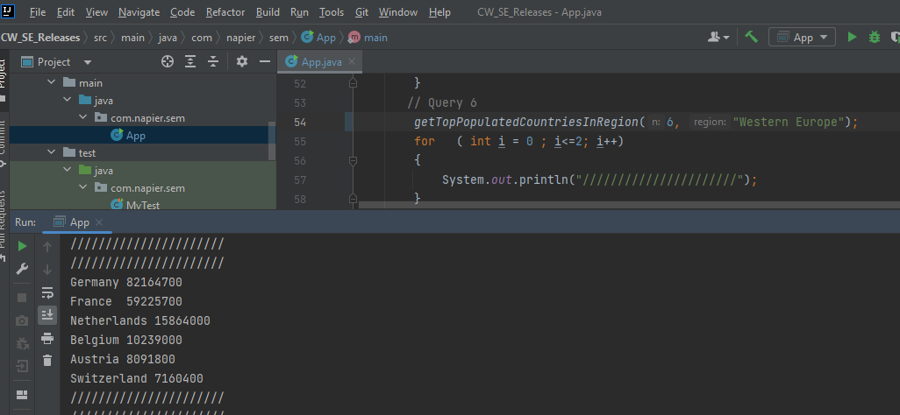

# CW_SE_Releases
the main repository for the CW

| ID | Name | Met | ScreenShot |
|:---|:----:|:---:|-----------:|
| 1  | All the countries in the world organised by largest population to smallest.    | Yes | |
| 2  |All the countries in a continent organised by largest population to smallest.    | Yes | |
| 3  | All the countries in a region organised by largest population to smallest.    | Yes | |
| 4  | The top N populated countries in the world where N is provided by the user.    | Yes | |
| 5  | The top N populated countries in a continent where N is provided by the user.    | Yes | |
| 6  | The top N populated countries in a region where N is provided by the user.    | Yes | |
| 7  | All the cities in the world organised by largest population to smallest.
    | Yes | |
| 8  | All the cities in a continent organised by largest population to smallest.
     | Yes | |
| 9  | All the cities in a region organised by largest population to smallest.    | Yes | |
| 10  | All the cities in a country organised by largest population to smallest.     | Yes | |
| 11  | All the cities in a district organised by largest population to smallest.     | Yes | |
| 12  | The top N populated cities in the world where N is provided by the user.     | Yes | |
| 13  | The top N populated cities in a continent where N is provided by the user.     | Yes | |
| 14  | The top N populated cities in a region where N is provided by the user.     | Yes | |
| 15  | The top N populated cities in a country where N is provided by the user.    | Yes | |
| 16  | The top N populated cities in a district where N is provided by the user.    | Yes | |

| Mat Number | CR1 | CR2 | CR3 | CR4 |
|:-----------|:---:|:---:|:---:|----:|
| 40597506  | 33% | 33% | 40% | 40% |
| 40598699 | 33% | 33% | 20% | 20% |
| 40521893 | 33% | 33% | 40% | 40% |
